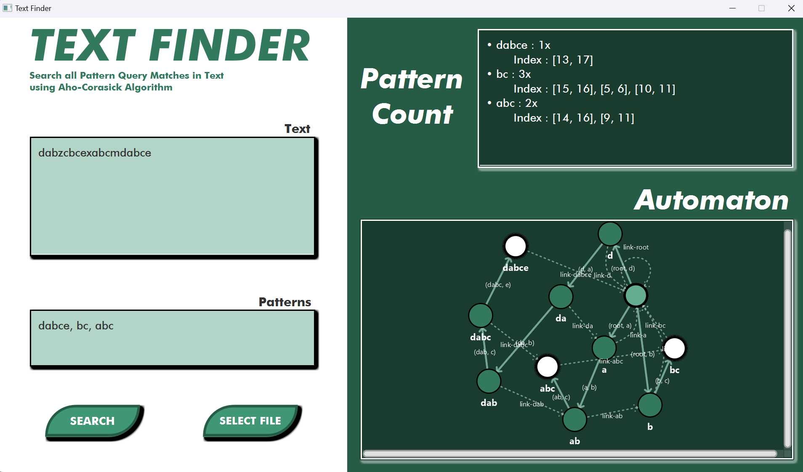

# Aho-Corasick-Text-Finder
Pattern Query Finder using Aho-Corasick Algorithm as my submission for Computational Engineering Laboratory Assistant Selection. Implemented using Java language and utilizing JavaFX library for a rich graphical user interface (GUI).

<div align="center">
   <br />
</div>

<br>

## Getting Started

### Prerequisites

Before you start, ensure you have the following installed:

- **Java Development Kit (JDK) 22 or higher:** [Download JDK](https://www.oracle.com/java/technologies/downloads/#java22) or use [OpenJDK](https://openjdk.java.net/).
- **Apache Maven 3.8.0 or higher:** [Download Maven](https://maven.apache.org/download.cgi).
- **JavaFX SDK 22.0.2 or higher:** [Download JAvaFX SDK](https://jdk.java.net/javafx22/).

### Installation

Follow these steps to set up the project locally:

1. **Clone the repository:**
   ```bash
   git clone https://https://github.com/Farhannr28/Aho-Corasick-Text-Finder

2. **Navigate to the directory including pom.xml:**
   ```bash
   cd Aho-Corasick-Text-Finder/text-finder

3. **Build the Application:**
   ```bash
   mvn clean package assembly:single

### Run the Application

  Firstly, locate the directory of your JavaFX SDK. Copy the path to javafx-sdk-xx.x.x\lib and navigate to the directory of your resulting .jar file. Run the following command:
  
  ```bash
  java --module-path '[JavaFX SDK /lib path]' --add-modules javafx.controls,javafx.fxml -jar App-1.0-SNAPSHOT-jar-with-dependencies.jar
  ```

<br>

## Usage

The following are the steps to find all patterns in a text. Once the application is opened, this is what the GUI looks like.

<div align="center">
   <br />
</div>

1. **Create a JSON input file:**

   The target text and query patterns must be formatted as follow

   ```json
     {
       "text": "TARGET TEXT",
       "patterns": ["QUERY PATTERN 1", "QUERY PATTERN 2", "QUERY PATTERN 3"]
     }
     ```

   For example, a simple testcase might look like

   ```json
     {
       "text": "saya sangat suka matkul irk. saya jadi ingin makan ayam.",
       "patterns": ["saya", "ayam", "aman"]
     }
     ```

2. **Import the JSON file:**

   Click the *Select File* button to open File Selector window. After the file selected you can see confirmation the *text* and *patterns* section.

   <div align="center">
      <br />
   </div>

4. **Start the Search:**

   Click the *Search* button to initiate Aho-Corasick algorithm

5. **Receive the result:**

   The result can be viewed on your right hand side. For our example, the result looks as such

   <div align="center">
      <br />
   </div>

   ### Pattern Count

   Each pattern have their own pattern count which is signified by the number written next to *x*, for clarity *2x* means the pattern appears twice in the text. Each instance of the pattern is also highlighted below their name after the *Index:*. In each bracket, there are indexes of ranges where this particular instance appeared, such *[x,y]* means this instance appeared from index *x* until *y* in the original text. Note that this is a zero indexing.

   ### Automaton

   This area visualizes the automaton used for Aho-Corasick, the finite state machine which is the reason of this algorithm's efficiency. The node with a ligher green color represents the root which is the start of our automaton. Darker green nodes are the common states, each labeled by a prefix appearing on every pattern in our set. Every state have a transition to another signified by the solid line, with arrows pointing to which state this character brings. In Aho-Corasick automaton, there also exists a failure-link to let automaton jump to another state even when a matching character transition doesn't exists. This is drawn by the broken line, pointing to where the link leads. Every state signifying a pattern in the set is colored white, formally this is our end state. The whole Automaton diagram makes use of the [Smart Graph](https://github.com/brunomnsilva/JavaFXSmartGraph) library by brunomnsilva

<br>

## Library Used

- JavaFX
- Smart Graph by Juno Silva
- json 20240303

## Authors

Project Author: **Farhan Nafis Rayhan - 13522037** - [(GitHub page)](https://github.com/Farhannr28)
